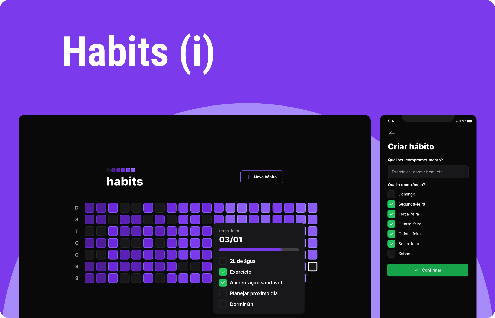
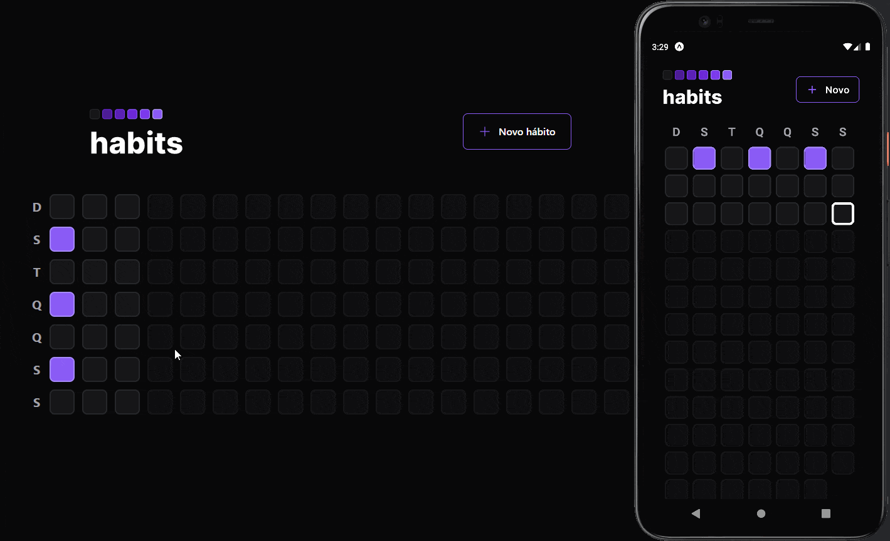

    <h1 align="center">
        
         

<a aria-label="Completed" href="https://rocketseat.com.br/">
    </img>
</a>

    </h1>

 

  <a href="#speech_balloon-Sobre">About</a>&nbsp;&nbsp;&nbsp;|&nbsp;&nbsp;&nbsp;
  <a href="#camera-Preview">Preview</a>&nbsp;&nbsp;&nbsp;|&nbsp;&nbsp;&nbsp;
  <a href="#rocket-Tecnologias">Technologies</a>&nbsp;&nbsp;&nbsp;|&nbsp;&nbsp;&nbsp;
  <a href="#framed_picture-Demonstration">Demonstration</a>

## :speech_balloon: About

This application was developed during the NLW-Setup event of [Rocketseat](https://www.rocketseat.com.br/ignite).

O **habits** is an application designed to monitor daily habits.

With it, it is possible to create a list of habits to incorporate into your routine, and follow through the summary presented in the application, the frequency with which each habit is being practiced, allowing you to visualize your progress over time and motivate yourself to move on.

## :camera: Preview

  

## :rocket: Technologies

- [ReactJS](https://reactjs.org/)
- [Tailwind CSS](https://tailwindcss.com/)
- [React Native](https://reactnative.dev/)
- [NativeWind](https://www.nativewind.dev/)
- [React Native Reanimated](https://docs.swmansion.com/react-native-reanimated/)
- [TypeScript](https://www.typescriptlang.org/)
- [Node.js](https://nodejs.org/en/docs/)
- [Expo](https://expo.dev/)
- [Fastify](https://www.fastify.io/)
- [Prisma ORM](https://www.prisma.io/)
- [Zod](https://github.com/colinhacks/zod)

## :framed_picture: Demonstration

  

 Made with :purple_heart: 

